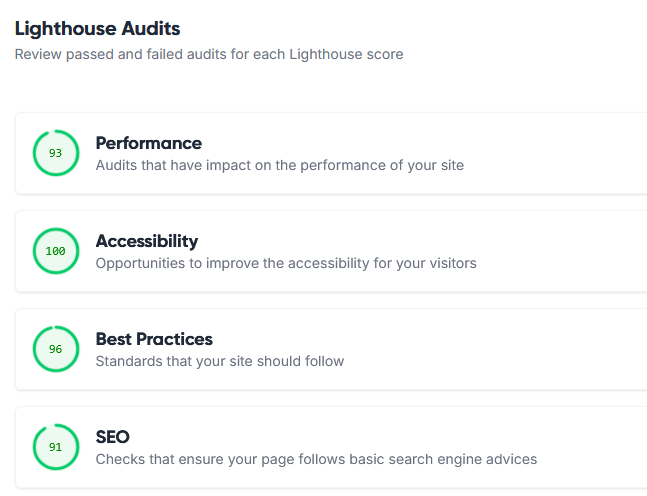
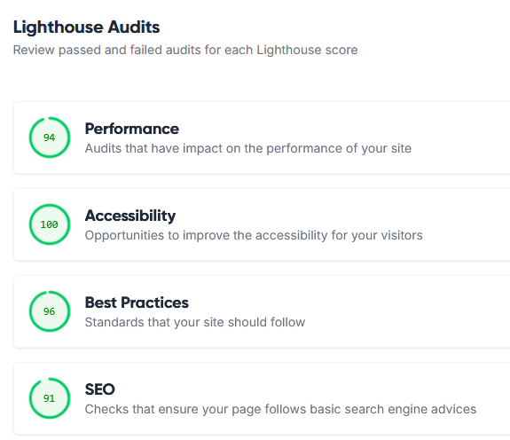

# Testing

## Contents

- [Manual Testing](#manual-testing)
- [Browser Testing](#browser-testing)
- [Database Testing](#database-testing)
- [Python Validation](#python-validation)
- [JavaScript Validation](#javascript-validation)
- [CSS Validation](#css-validation)
- [HTML Validation](#html-validation)
- [Lighthouse Testing](#lighthouse-testing)

## Manual Testing

The following tests were carried out manually to ensure the portal is working correctly

| **Feature**   | **Action**                    | **Expected Result**          | **Actual Result** |
| ------------- | ----------------------------- | ---------------------------- | ----------------- |
| User Registration | Register a new user | User account is created, and a confirmation email is sent (if enabled) | Works as expected |
| User Login | Login with valid credentials | User is redirected to the dashboard | Works as expected |
| Search for Mentors | Pick a language and search for matching mentors | Matching mentors are shown | Works as expected |
| Direct Messaging | Send a message to a matching mentor | Message form is send and a success message shown | Works as expected |
| Forum Posting | Create a forum post | Post appears in the forum | Works as expected |
| Forum Replies | Reply to a forum post | Replies appear under the post | Works as expected |
| Profile Update | Edit user profile | Profile updates successfully | Works as expected |
| Contact Admins | Submit a contact form | Contact form is send to connected admin email | Works as expected |

## Browser Testing
The program was tested in the following browsers by myself and others: 

- Firefox 
- Brave
- Safari

It worked without issues in the above browsers

## Database Testing
The Database was accessed with the admin account and all database models show up correctly. User accounts can also be accessed correctly. 

## Python Validation
All Python Files have been passed through the [CI PEP8 Python Linter](https://pep8ci.herokuapp.com/) and returned no errors except E501 line too long

## JavaScript Validation
All JavaScript code has been passed through the [JSHint Validator](https://jshint.com/) and returned the general error E501 line too long. 

## CSS Validation
All CSS code has been passed through the [Jigsaw Validator](https://jigsaw.w3.org/css-validator/) and returned no errors.

## HTML Validation
All HTML code has been passed through the [W3C validator](https://validator.w3.org/) and returned no errors.

## Lighthouse Testing
The accessiblity of the page has been tested via  for the home and about page, as they have the most page load.

